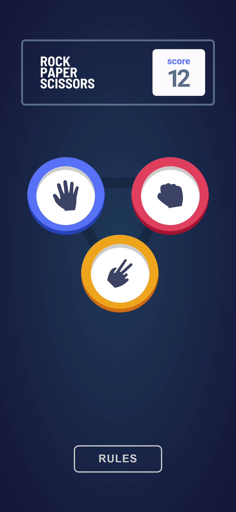

# Frontend Mentor - Rock, Paper, Scissors solution

This is a solution to the [Rock, Paper, Scissors challenge on Frontend Mentor](https://www.frontendmentor.io/challenges/rock-paper-scissors-game-pTgwgvgH). Frontend Mentor challenges help you improve your coding skills by building realistic projects. 

## Table of contents

- [Overview](#overview)
  - [The challenge](#the-challenge)
  - [Screenshot](#screenshot)
  - [Links](#links)
- [My process](#my-process)
  - [Built with](#built-with)
  - [What I learned](#what-i-learned)
  - [Continued development](#continued-development)
  - [Useful resources](#useful-resources)
- [Author](#author)
## Overview

### The challenge

Users should be able to:

- View the optimal layout for the game depending on their device's screen size
- Play Rock, Paper, Scissors against the computer
- Maintain the state of the score after refreshing the browser _(optional)_
- **Bonus**: Play Rock, Paper, Scissors, Lizard, Spock against the computer _(optional)_

### Screenshot

### Links

- [ Solution ](https://github.com/mostafa-meerzad/rock-paper-scissor)
- [ Live site ](https://eclectic-capybara-d794c9.netlify.app/)

## My process

### Built with

- Flexbox
- CSS Grid
- Mobile-first workflow
- [React](https://reactjs.org/) - JS library
- [Framer-motion](https://www.framer.com/motion/) - Animation library for React JS

### What I learned

How complex apps are structured, Using Framer-motion, Checking for mediaQueries  if they match in JavaScript

### Continued development

I struggled a lot making options-spinner animating it and placing all element together while they are acting independently.

### Useful resources

- [Change animations based on mediaQuery in framer-motion ](https://samuelkraft.com/blog/responsive-animation-framer-motion) - This helped me to add different animations based on DOM matching different mediaQueries.

## Author

- Frontend Mentor - [@mostafa-meerzad](https://www.frontendmentor.io/profile/mostafa-meerzad)
- Github - [mostafa-meerzad](https://github.com/mostafa-meerzad)
- Instagram - [mostafa-meerzad](https://www.instagram.com/mostafameerzad/)
- linkedIn - [mostafa-meerzad-a753371b7](https://www.linkedin.com/in/mostafa-meerzad-a753371b7)

